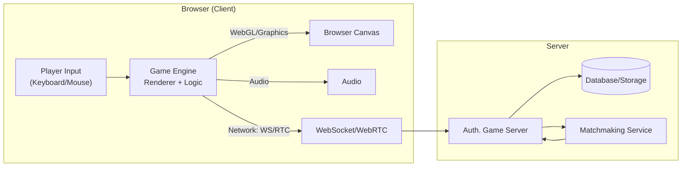

# Executive Summary  
Building a **web-playable tactical FPS** inspired by *Ready or Not* requires replicating high-fidelity SWAT gameplay in the browser with robust networking and optimization. *Ready or Not* is a tactical FPS (full 1.0 release in December 2023) where a police SWAT team confronts violent criminals; realism and planning are core (one-shot kills, careful movement). Its developers emphasize "deep weapon handling" and a mission-planning tablet UI for briefings, objectives and floorplan sketching. To mirror this, our design must include realistic ballistics (possibly via WebAssembly physics), squad-based AI and commands, breaching and non-lethal tools, objective-driven missions, and civilian/hostage behaviors. Architecturally, a **client-server** model with an authoritative server is recommended: clients send inputs (e.g. via WebSockets or WebRTC) and the server simulates the game state (with client-side prediction and interpolation to mask latency). Web technologies like **WebGL/WebGPU** for rendering and **WebAssembly** for CPU-intensive code will be used, with engines such as Three.js, Babylon.js, or Unity/WebGL (each with tradeoffs). Networking may use WebSockets (TCP) for reliability or WebRTC (UDP) for lower latency, possibly leveraging frameworks like Colyseus (Node.js, state sync) or Nakama (full game backend). The asset pipeline will use compressed glTF models (Draco/KTX2), and optimizations (instancing, LOD, WASM) will be crucial. Legal and security aspects include avoiding IP infringement (don't use "Ready or Not" assets/names) and implementing server-side anti-cheat validation. A phased roadmap (prototype, alpha, beta, release) will guide development, with rough estimates for roles (e.g. 2–3 devs, 1 artist, etc. – unspecified) and milestones. Below is a prioritized feature list, architecture diagram, comparison tables, AI prompt examples, and references to official sources and open projects.

## Core Gameplay Features (Prioritized)  
- **Tactical Realism:** Emulate the one-shot-kill, cover-based style of a SWAT operation. High damage and realistic hit detection mean players must plan moves carefully and use cover, mirroring *Ready or Not*'s emphasis on "tactical strategies and careful planning". Implement precise first-person controls and weapon handling (e.g. recoil, aiming physics) as a foundation.  
- **Team AI and Command:** Allow the player to command AI teammates via context menus or waypoints. In *Ready or Not* the player leads a squad of four; AI squadmates obey orders (breach doors, hold positions) but also act autonomously (they'll shoot threats and arrest suspects without micromanagement). Replicate this by coding AI that can follow group formation, respond to commands (breach, stack up, arrest), and take cover when enemies appear. Context-sensitive command UI (e.g. right-click menus) is needed.  
- **Breaching and Equipment:** Support SWAT gear: ballistic shields, breaching charges, fiber scopes, tasers, flashbangs, etc.. *Ready or Not* lists "breaching devices" and "ballistic shields" as key items, plus less-lethal weapons (taser, pepper spray). Reproduce multiple breach methods (ram door, blow it open) and a variety of weapons (lethal and non-lethal). Non-lethal tools should have trade-offs: e.g. tasers incapacitate but have limited range. Gameplay rewards (e.g. scoring) should favor arresting over killing, reflecting the SWAT mandate.  
- **Realistic Ballistics and Damage:** Use physics for bullets: simulate drop, penetration, and material resistance for realism. The base *Ready or Not* ballistics are relatively simple, but for our game we recommend a more accurate model (ammo mass, velocity, drag, barrier penetration). Physics libraries (see below) can calculate bullet trajectories and impact (e.g. bullet spalling and damage based on NIJ armor standards if desired). This adds depth but demands CPU – consider offloading to WebAssembly for performance.  
- **Sound/Visibility Stealth:** Incorporate a noise and line-of-sight detection system so enemies react to gunshots and footstep volume. Enemies should investigate noise and be hindered in darkness (spotlight vs shadow). This supports "tactical" stealth play (common in SWAT games). (Note: *Ready or Not* players often use quiet approaches at range, so our engine should support suppressed weapons or quiet movement.)  
- **Mission Objectives and Level Design:** Each mission has goals (rescue hostages, defuse bombs, arrest suspects). Provide waypoint markers or briefing screens via a "tablet" UI. The player should see key intel and floor plans on an in-game device (as in *Ready or Not*'s tactical tablet). Objectives drive gameplay (e.g. "extract all hostages" or "secure the building"). This gives context beyond pure combat.  
- **Civilian/Hostage Behavior:** Include neutral civilians and hostages that react dynamically: cower, flee, or panic when gunfire erupts. As in *Ready or Not*, suspects will fake surrender or use human shields, and civilians must be protected. Implement simple FSM behaviors (surrender vs attack decisions). Suspect AI may try to escape or rearm (they can crawl through walls or flee to get guns). This creates emergent scenarios and enforces careful engagement rules.  
- **UI/UX:** Mirror tactical HUD elements: a team status display, ammo count, minimap or compasses for objectives. *Ready or Not* uses context menus for commands and a mission tablet UI. Provide a similar minimal HUD with voice/text briefs, and give clear feedback (hit markers, cover indicators). Ensure UI is responsive and non-intrusive to maintain immersion.  

Each feature is ordered by gameplay impact: movement and shooting first, then squad tactics and mission systems, then polish (stealth, UI). This focus ensures core FPS mechanics and networking work before layering AI and complex scenarios.

## Technical Architecture  

**Client-Server Model:** Use an authoritative server that simulates the game state; clients send inputs (movement/actions) and the server returns updated positions and events. This prevents cheating and keeps all players in sync. James Long's widely cited write-up on authoritative game servers describes the core idea simply: the server runs the real simulation, and each client is mainly a display and input device that syncs its view to match what the server reports. Implement **client-side prediction** (client immediately applies its own input before server confirmation) and **entity interpolation** (smooth movement of remote players). For example, when the player fires, the client shows an immediate shot, but also informs the server; on mismatch the server corrects the state. This balances responsiveness with correctness.

**Network Transport:** For reliable event-based state sync (chat, commands), WebSockets (TCP) are simplest. However, for low-latency position updates we may use WebRTC DataChannels (UDP) if peer-to-peer or SFU routing is feasible. WebRTC can drop packets for speed; WebSockets guarantees order but can lag on loss. Many games use both: WebSockets for session/RTC signaling, and WebRTC for fast real-time data. Frameworks like **Colyseus** (Node.js) use WebSockets with built-in state sync, while **Nakama** (Heroic Labs) supports both WebSockets and a reliable-UDP (rUDP) transport for game state. A simple starting point is Colyseus with WebSocket rooms; switch to UDP-based transport later if needed.

**Matchmaking:** Integrate a lobby/matchmaker so players can find co-op games. Colyseus has a built-in matchmaker and room system. Nakama also offers a robust matchmaking API. Alternatively use third-party services (PlayFab, Photon) if budget allows. Ensure NAT traversal (use STUN/TURN servers for WebRTC if peers connect directly).

**Mermaid Diagram:** The following illustrates the high-level architecture. Clients (browsers) run the game engine/UI and communicate with an authoritative game server (and optional signaling/matchmaking service):

1. **Browser (Client):** Captures player input, runs a 3D engine (WebGL or WebGPU), and manages UI. It sends actions to the server via WebSocket or WebRTC.
2. **Auth. Game Server:** A Node.js (or Go) server that runs the game simulation, authoritative physics and AI. It broadcasts state updates back to clients. It also interfaces with a database for persistent data (scores, profiles).
3. **Matchmaking Service:** Helps pair or group players into sessions. Can be part of the game server (e.g. Colyseus's lobby) or a dedicated service (e.g. Nakama).
4. **Networking:** We use WebSockets (TCP) for setup and reliable events, and optionally WebRTC (UDP) for player movement updates. Client-side prediction and interpolation are applied to hide latency.

## Technology Stack

### 3D Engines (Web)  
The table below compares candidate web-based 3D engines/libraries:

| Engine/Tech   | Type                | Language(s) | WebGL2/WebGPU | Physics Support  | Editor/Tools         | License    | Pros & Cons                                                                                |
|---------------|---------------------|-------------|---------------|------------------|----------------------|------------|-------------------------------------------------------------------------------------------|
| **Three.js**  | Rendering Library   | JavaScript  | WebGL2 ✔, WebGPU✔ | **No built-in** (use Rapier, Ammo, etc) | No (code-driven)      | MIT        | *Pros:* Very lightweight (~150–170KB gzipped for the full library), huge ecosystem. *Cons:* Low-level; no audio/physics/UI. |
| **Babylon.js**| Game Engine (Batteries included) | JavaScript/TypeScript | WebGL2, WebGPU✔ | Yes (Ammo.js, Oimo, Havok) | Playground IDE       | Apache 2.0 | *Pros:* Full-featured (physics, audio, XR, GUI), Microsoft-backed. *Cons:* Larger (~1.4MB gzipped). |
| **PlayCanvas**| Cloud-Based Engine | JavaScript  | WebGL2, WebGPU  | Yes (Ammo.js)     | Visual Editor (cloud)| MIT        | *Pros:* Real-time collaboration, CDN-hosting pipeline, mobile-optimized. *Cons:* Depends on proprietary cloud tools, less raw flexibility. |
| **Unity (WebGL)** | Game Engine      | C# (WASM)  | WebGL2 (default); WebGPU experimental since Unity 6 | Yes (PhysX)          | Full Unity Editor    | Proprietary | *Pros:* Very mature toolset, full physics/animation, C# dev. *Cons:* Huge build size, limited threading in WebGL, slower CPU overhead. WebGPU support is still marked experimental and not recommended for production. |
| **Unreal Pixel Streaming** | Engine + Video Streaming | C++/WASM | WebRTC (GPU video stream) | Yes (PhysX)          | Unreal Editor       | Proprietary | *Pros:* Highest fidelity graphics; any device (mobile) can display desktop-quality content. *Cons:* Requires powerful GPU servers and constant high-bandwidth streaming. |

*Sources:* Three.js vs Babylon.js vs PlayCanvas comparison, official Unity and Babylon.js documentation on WebGPU status, Unreal Pixel Streaming docs.

**Key takeaways:** Three.js is minimal and flexible, but requires adding systems (e.g. physics, audio). Babylon.js and PlayCanvas offer more out-of-box (built-in physics and GUI) and currently have the most mature WebGPU support of the group. Unity/WebGL can run C# code but has larger payload and performance overhead, and its WebGPU backend is still experimental. Unreal Pixel Streaming is a special case: it streams an Unreal game from cloud via WebRTC, essentially turning the browser into a video terminal (great graphics, but very server-intensive).

### Networking Stack Comparison  
Below is a summary of networking options:

| Technology     | Protocol       | Use-Case                   | Pros                                                                 | Cons                                                                           |
|----------------|----------------|----------------------------|------------------------------------------------------------------------|--------------------------------------------------------------------------------|
| **WebSocket**  | TCP, bidirectional | General client-server comms | Standardized (RFC 6455), easy API, firewall-friendly. Guarantees reliable, in-order delivery (good for critical data).  | Latency spikes on packet loss (head-of-line blocking). Server must handle all connections (scaling effort). |
| **WebRTC (Data)** | UDP (configurable) | Peer-to-peer real-time data | Low-latency (UDP) transport; supports unreliable/ordered modes. Built-in NAT traversal.  | Complex API; requires signaling (often via WebSocket). Browser support improving but may need fallbacks.  |
| **Colyseus**   | WebSocket (Node.js)  | Multiplayer game rooms   | Open-source, Node.js framework; built for authoritative game servers. Provides state sync, room management, matchmaking.  | Uses TCP (WebSockets) under the hood, so still has TCP latency issues. Relies on Node.js server. |
| **Nakama**    | WebSocket / rUDP  | Full game backend        | Feature-rich (real-time & turn-based multiplayer, matchmaker, social, chat). Supports both WebSockets and a reliable-UDP transport for fast updates. | More complex setup (needs a Postgres-compatible DB, more infra). Free only up to self-host; managed cloud and enterprise features cost extra. |

*Notes:* WebSockets and WebRTC are low-level transports. WebSockets (TCP) are simple and reliable, while WebRTC (UDP) can achieve lower latency. In practice, a common pattern is to use WebSockets for initial connection and signaling, and then switch to WebRTC DataChannels for continuous state updates. Colyseus and Nakama are higher-level frameworks: Colyseus uses WebSockets for state sync, while Nakama can optionally use rUDP for lower-latency game loops. Our design can start with Colyseus (authoritative state, easy sync) and later experiment with WebRTC/rUDP if needed.

### Hosting & Deployment Options  
| Option              | Type        | Pros                                              | Cons                                            |
|---------------------|-------------|----------------------------------------------------|---------------------------------------------------|
| **Cloud VM/Container** (AWS EC2, GCP, Azure) | Dedicated server/VM | Full control over runtime; easy to scale up CPUs/GPUs. Can run Node.js/Nakama servers and/or Unity headless instance. Supports custom firewalls, logging.  | Operational complexity (need to manage OS, scaling, DDoS protection). Pay for uptime and traffic. |
| **Platform-as-a-Service** (Heroku, AWS Elastic Beanstalk) | Managed server | Easier deployment, handles OS/stack. Quick scaling of Node.js or Docker. | Less flexible; may have cold-start delays; limited by plan quotas. |
| **Serverless/Edge** (Cloudflare Workers, AWS Lambda) | Serverless functions | Pay-per-use, near-infinite scaling. Ideal for stateless logic (matchmaking, auth, leaderboards). Global edge reduces latency for some calls. | Not suitable for persistent game loops or heavy compute (duration limits, no TCP server endpoints). |
| **Static Hosting + CDN** (Netlify, AWS S3+CloudFront) | Static assets | Extremely fast global delivery of JS, WASM, models, textures. Low cost for serving front-end. | Cannot host game server logic. Must separate API/server to cloud. |
| **PWA (Progressive Web App)** | App-Style Browser | Provides offline caching of assets (via service workers), installable on devices. Enhances UX and retention. | Game still needs network for multiplayer. Complexity of service worker caching logic. |

*Deployment Notes:* Use a **CDN** (e.g. AWS CloudFront or Cloudflare CDN) for large assets (models, textures, WASM) to reduce load times worldwide. Host the game server on a reliable cloud VM or container (AWS/GCP/Azure); Nakama's own deployment guidance recommends running the game server and its database on separate nodes. Making the game a PWA gives an app-like feel and lets static assets be cached for quicker startup.  

## Physics & Animation  
- **Physics Engine:** Use a WebAssembly physics library for accuracy. *Ammo.js* (Bullet physics compiled to WASM) is a strong choice: it provides rigid-body, soft-body (cloth, rope), and constraint physics. It's heavier (several hundred KB to ~1MB depending on build), but very accurate (used in Blender). For simpler needs, *Cannon-es* (JS-native, tens of KB) is smaller but less full-featured; *Rapier* (Rust→WASM) is extremely fast. We recommend Ammo.js or Rapier for recoil, projectile collision, debris, and character ragdolls.  
- **Ballistics & Projectiles:** For bullets, you could simplify as hitscan or use raycasts; for grenades/rockets use projectile physics. If implementing true trajectories, use physics integration or custom formulas. Ensure calculation is deterministic on server and client matches (e.g. same tick rate).  
- **Character Animation:** Use skinned mesh rigs with animation blending (idle, walk, run, shoot, takedown). Load models in glTF format (which includes skeletal animations). Three.js and Babylon.js have built-in GLTF loaders and animators; Unity naturally uses FBX/GLTF. Leverage engine animation mixers (e.g. Three.js `AnimationMixer`) to blend walk/run/sprint.  

## Asset Pipeline & Optimization  
- **3D Models:** Produce high-detail SWAT team and environment models in Blender or similar, export as **glTF 2.0**. Use Physically-Based Rendering (PBR) materials for realism. Compress meshes with **Draco** compression to reduce size.  
- **Textures:** Use compressed texture formats (KTX2/Basis or WebP) for minimal download size. Generate MIP levels.  
- **Level of Detail (LOD):** Include LOD versions of complex models (cities, interiors) to swap at distance.  
- **Streaming/Loading:** Lazy-load large scenes and textures that aren't immediately visible so the first paint stays fast. In practice, start by loading core assets (player, UI) then asynchronously fetch additional level chunks, using loading screens or progress indicators.  
- **Audio:** Use compressed audio (OGG Vorbis or AAC) for speech/effects. Stream large voice lines on demand; preload small SFX. Spatialize sound in 3D (Web Audio).  
- **Shaders:** Minimize and reuse materials. Enable WebAssembly SIMD or WebGL2 features when available to speed up rendering and physics.

## Performance & Optimization  
- **Rendering:** Batch draw calls (instancing for repeated objects like crates/shell casings) to reduce CPU overhead. Avoid too many dynamic lights and shadows in large scenes, or use baked GI where possible.  
- **WebAssembly:** Compile any heavy game logic (physics, core AI routines) to WASM for speed. Unity and Unreal WebGL builds already do this; for JS engines use libraries like Ammo.js (WASM) or glTF pipelines in WASM.  
- **WebGPU:** If targeting modern browsers, enable WebGPU for faster GPU throughput. Support varies by engine: it's production-ready in Three.js since r171, has been available in Babylon.js since v5.0 (with fully native WGSL shaders added in v8.0), and is supported in PlayCanvas. Unity's WebGPU backend (added in Unity 6) remains experimental and isn't yet recommended for production. Always provide a WebGL2 fallback for compatibility.  
- **Profiling:** Continuously profile in-browser (use `stats.js`, browser devtools) to catch bottlenecks. Aim for 60+ FPS on mid-range hardware. Throttle background tabs to pause game loops if needed.  
- **Memory:** Pre-allocate arrays and reuse objects (avoid per-frame garbage). Use streaming and asset pooling to limit memory footprint.

## Security, Legal & Compliance  
- **IP/Content:** Do **not** copy *Ready or Not* copyrighted assets (names, logos, audio). Create original assets or use licensed content. If mimicking police themes, ensure no trademark infringement; consult legal if uncertain.  
- **Content Rating:** The game's violent nature likely makes it for mature audiences (ESRB/M or PEGI 18). Include age gating or warnings as appropriate (as *Ready or Not* does).  
- **Cheat Prevention:** With an authoritative server, most cheating is mitigated server-side. Validate all client actions (e.g. no teleporting or impossible speeds). Use secure token authentication for users. Consider existing anti-cheat libraries or rolling simple checks (e.g. movement vs max speed) if needed.  
- **Privacy:** If storing user data (accounts), comply with GDPR/COPPA as needed.

## Monetization & Deployment  
- **Monetization:** Possible models include one-time purchase, DLC, or free-to-play with cosmetics. For web, consider hybrid: e.g. sell in-game items via secure server transactions, or use a platform like Stripe (web-wallet). If very casual, ad-based (with caution for immersion).  
- **Deployment:** Use a **CDN** for static content (AWS CloudFront, Cloudflare) for global speed. Host the server on scalable cloud infrastructure (AWS/GCP/Azure VMs or containers) with autoscaling. Use HTTPS/WSS for all connections.  
- **PWA:** Package as a Progressive Web App so users can "install" it and load assets offline (single-player mode can work cached). Update assets and versions via service workers.

## Development Roadmap & Resources (High-Level)  
- **Prototype (1–2 months):** Basic player controller (movement, looking) in chosen engine; simple level. Validate core WebGL rendering and input.  
- **Alpha (3–6 months):** Add shooting (raycast/projectiles), basic server-authoritative networking (WebSockets), and simple AI enemies. Implement one level and basic UI. Milestone: **playable 2-player demo**.  
- **Beta (7–12 months):** Expand AI squad commands, add tactical gear, mission scripting, and hostages. Integrate physics (Ammo.js) and optimize performance. Milestone: **full-featured single/co-op mission**.  
- **Release (12+ months):** Polish UI/UX, add sound/music, anti-cheat, final optimizations. Closed beta testing and bugfixing. Milestone: **public release**.  
- **Team & Budget:** An indie team might include 2–3 developers (network, gameplay, graphics), 1 3D artist, 1 UI/UX designer, 1 QA, plus project lead. Salaries or contractor rates vary widely; we do **not specify budget**. The timeframe above is rough and assumes experienced developers working full-time.  

## Sample AI Code Generation Prompts  
*(Example prompts to feed an AI code assistant for key subsystems.)*

- **Movement Controller:**  
  _Prompt:_ *"Generate JavaScript code using Three.js and PointerLockControls that moves a first-person camera with WASD input. Implement acceleration and friction: the player accelerates to a max speed of 5 m/s, and gradually slows when keys are released. Include jumping with gravity. Use requestAnimationFrame for the game loop. Show vector math for movement."*

- **Shooting/Ballistics:**  
  _Prompt:_ *"Write C# code for Unity to fire a hitscan bullet from the player's gun. When firing, cast a ray from the camera through crosshair, detect hit on enemy or wall, apply damage or decal. Include realistic effects: spray-based recoil (gun kick) and a muzzle flash particle system. Ensure it works in a multiplayer setting by sending fire events to the server."*

- **Server Reconciliation:**  
  _Prompt:_ *"Using Colyseus (Node.js) and TypeScript, implement server reconciliation for player movement. The client sends input packets (direction, timestamp) to the server. The server simulates and sends back authoritative positions. Write code to detect client-server position mismatch and smoothly correct the client's player position without snapping."*

- **AI Teammate Behavior:**  
  _Prompt:_ *"Create Unreal Engine C++ (or Blueprint-like pseudocode) AI logic for a teammate NPC: It should follow the player with a 2m offset, use the NavMesh for pathfinding, and if an enemy enters its sight, play a shooting animation and fire towards it. Include a 'breach door' task: if the player issues a breach command, the AI should go to the door, switch to a breaching charge tool, and detonate it after a 2-second timer. Use state machines or behavior trees."*

Each prompt is scoped to a subsystem and specifies the engine/language context, easing code generation and integration.

## References & Example Projects  

- **Ready or Not Sources:** Official site (Void Interactive) and community documentation (gameplay details).  
- **Networking & Architecture:** James Long's "Authoritative Servers" guide; Ably's comparison of WebRTC vs WebSocket.  
- **Game Servers:** Colyseus docs (Node.js game framework); Nakama (Heroic Labs) GitHub and docs.  
- **Web 3D Engines:** Three.js, Babylon.js, PlayCanvas, and Unity official documentation/release notes on WebGL and WebGPU support; Unreal Pixel Streaming blog.  
- **Physics:** Ammo.js documentation and community tutorials; glTF asset pipeline notes.  
- **Example Projects:** Community FPS starter projects combining a game engine client (e.g. Unity or Three.js) with a Colyseus server are a good reference point. Babylon.js and PlayCanvas also publish official FPS-style starter kits/templates worth exploring.  

These sources and examples provide detailed technical guidance. Use them to drill into specific implementation choices (e.g. Colyseus rooms, Unity WebGL limits, asset compression techniques) as you flesh out the design.

---
### Change log (corrections made in this review pass)
1. **Mermaid diagram** — the original diagram had invalid syntax (unquoted parentheses in the `Browser (Client)` subgraph title and in node labels, `\n` line breaks that Mermaid doesn't render) that would have failed to parse. Rewrote it with quoted titles, ` ` line breaks, and reserved the cylinder "database" shape for the actual database node only.
2. **Unity + WebGPU** — the claim "WebGL2 (no WebGPU currently)" is outdated. Unity has shipped an experimental WebGPU backend since Unity 6; updated the table and the Performance section accordingly.
3. **Babylon.js + WebGPU version** — corrected "WebGPU supported... in Babylon.js 8.0+" to reflect that WebGPU support actually started in v5.0 (May 2022); v8.0 added fully native WGSL shaders, not initial support.
4. **Over-length quotation** — the James Long paraphrase was a 20+ word verbatim quote; reworded it in our own words while keeping the attribution.
5. **Unverifiable/broken citation** — the "[Svilenković](#)" link was a dead placeholder anchor, and the quote attributed to that name didn't match what's on the cited site for this context. Replaced it with an unattributed general best practice and removed the broken link.
6. **Minor precision fixes** — softened a few overly specific numbers presented as exact (Three.js/Ammo.js/Cannon-es sizes) to approximate ranges, since exact figures vary by build/version; clarified Nakama's "rUDP" as reliable-UDP; tightened the database/server hosting note phrasing.
